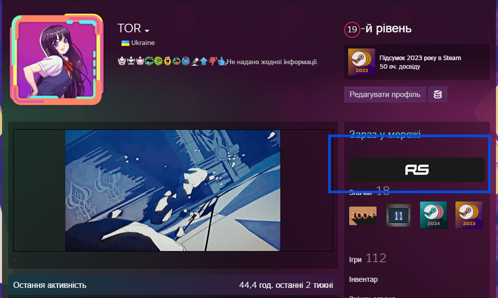
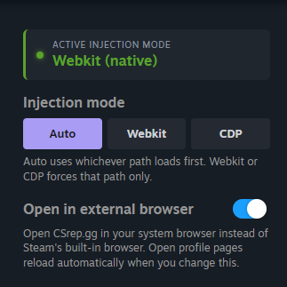

# Rust Stats Extension for Millennium

A Millennium plugin that integrates Ruststats button into the Steam client profile.

## 📋 Prerequisites

Before installing this plugin, ensure you have:

-   **[Millennium](https://steambrew.app/)** installed and configured

### Example




### Millennium Library Manager


---

## 🚀 Installation Guide

### Method 1: Millennium Plugin Installer (Recommended)

1. **Copy Plugin ID**

    Copy the following Plugin ID

2. **Install via Millennium**

    - Open Steam with Millennium installed
    - Go to **Millennium** → **Plugins**
    - Click on the **Install a plugin**
    - Paste the Plugin ID into the installer
    - Click **Install**
    - Restart Steam when prompted

### Method 2: Build from Source

#### Step 1: Clone the Repository

```bash
git clone https://github.com/TOR968/ruststats-extension.git
cd ruststats-extension
```

#### Step 2: Install Dependencies

**Install dependencies with [Bun](https://bun.sh/):**

```bash
# Install Bun if you haven't already (https://bun.sh)

# Install project dependencies
bun install
```

#### Step 3: Build the Plugin

**For development:**

```bash
bun run dev
```

**For production:**

```bash
bun run build
```

#### Step 4: Install to Steam

**Option A: Copy to plugins directory**

```bash
# Windows
copy /R . "C:\Program Files (x86)\Steam\millennium\plugins\ruststats-extension"

# Linux
cp -r . ~/.local/share/millennium/plugins/ruststats-extension

# macOS
cp -r . ~/Library/Application\ Support/millennium/plugins/ruststats-extension
```

**Option B: Create symbolic link (for development)**

```bash
# Windows (run as Administrator)
mklink /D "C:\Program Files (x86)\Steam\millennium\plugins\ruststats-extension" "%CD%"

# Linux/macOS
ln -s "$(pwd)" ~/.local/share/millennium/plugins/ruststats-extension
```

#### Step 5: Enable Plugin in Steam

1. Completely close Steam (including system tray)
2. Restart Steam
3. Go to **Millennium** → **Plugins**
4. Enable "Ruststats Extension"
5. Restart Steam once more

---

## 🔗 Links

-   [Millennium Framework](https://github.com/SteamClientHomebrew/Millennium)
-   [Ruststats](https://ruststats.io)
-   [Steam Client](https://store.steampowered.com/about/)
